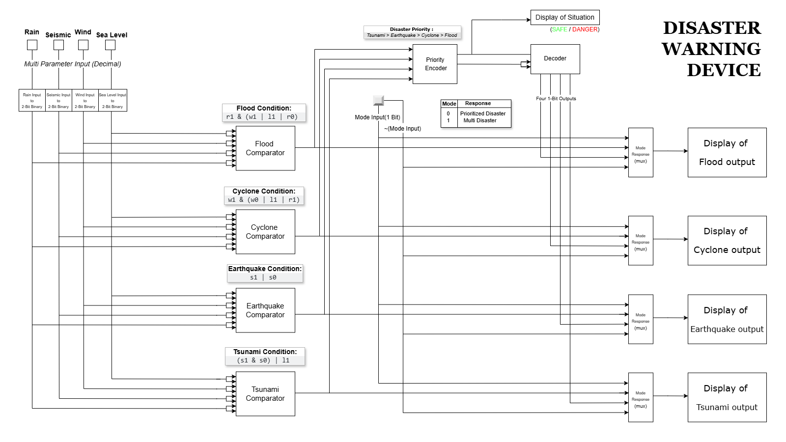
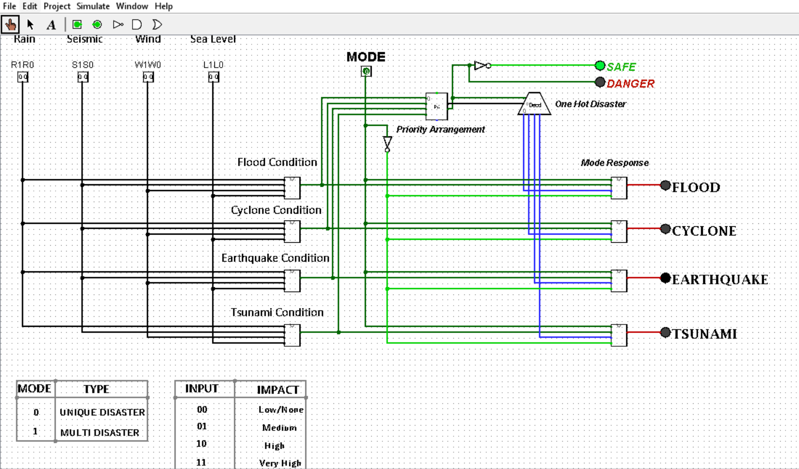

# Disaster Warning Device

A digital logic–based warning system that identifies Flood, Cyclone, Earthquake, and Tsunami hazards using decimal environmental inputs. It evaluates threshold-based conditions and reports the disaster hazards based on selected mode by the User.

<!-- First Section -->
## Team Details

  
Detail

  > **Semester:** 3rd Sem B. Tech. CSE  

  > **Section:** S1  

  > **Team ID:** s1-19  

  > **Team Lead:** Poluri Sai Jishnu, 241CS140, saijishnup.241cs140@nitk.edu.in/saijishnup@gmail.com  

  > **Member:** Utkoor Venkatesh, 241CS161, utkoorvenkatesh.241cs161@nitk.edu.in  

  > **Member:** Vikash Patel, 241CS163, vikashpatel.241cs163@nitk.edu.in  

## Abstract

  
Detail

  
 #### **Core Background:**  
  Natural disasters such as floods, cyclones, earthquakes, and tsunamis create significant threats to communities and infrastructure. Early warning systems help reduce impact and improve response efforts. This project applies digital logic techniques to classify potential hazards using threshold-based environmental indicators. By converting real-world measurements into binary levels, the system identifies the most probable disaster event.  

 #### **Project Working:**  
  The device receives four environmental inputs—Rainfall, Seismic activity, Wind speed, and Sea Level—each encoded into 2-bit levels ranging from Low to Very High.  
  • Logical circuits assess Flood, Cyclone, Earthquake, and Tsunami conditions  
  • A priority encoder selects the highest-priority disaster when multiple occur  
  • Mode control supports Unique-Disaster and Multi-Disaster interpretation  
  • Final decoding activates one LED corresponding to the detected hazard  

 #### **Applications & Educational Value:**  
  • LEDs act as clear indicators for disaster conditions  
  • Compact digital design suitable for early warning prototypes  
  • Can be integrated into basic monitoring modules for hazard classification  
  • Illustrates the use of encoders, comparators, and decision logic in detection systems  

## Functional Block Diagram

  
Detail

  
  

<!-- Second Section -->
## Working

  
Detail

  
### **1. Flowchart**

---

### **2. Working Steps**
The system accepts four decimal environmental inputs—rainfall, seismic acceleration, wind speed, and sea-level rise. Each value is mapped to a corresponding 2-bit intensity level based on predefined thresholds.  
**Threshold Levels:**  
`00` (Low), `01` (Medium), `10` (High), `11` (Very High)

---
#### **2.1 Input Stage**

The system accepts four decimal environmental inputs—rainfall, seismic acceleration, wind speed, and sea-level rise. Each value is mapped to a corresponding 2-bit intensity level based on predefined thresholds.

**Threshold Levels:**  
`00` (Low), `01` (Medium), `10` (High), `11` (Very High)

| **Rainfall (mm/hr)** | **Seismic Activity (m/s²) x 10**   | **Wind Speed (kmph)**    | **Sea Level Rise (cm)** | **Output**   `x1 x0` |
|----------------------------------|-------------------------------------------|------------------------------------|----------------------------------------|--------------------------|
| 0–2                              | 0–0.1                                     | 0–15                               | 0–5                                    | 00                       |
| 3–10                             | 0.2–0.5                                   | 16–30                              | 6–20                                   | 01                       |
| 11–30                            | 0.6–1.5                                   | 31–60                              | 21–50                                  | 10                       |
| ≥ 31                             | ≥ 1.6                                     | ≥ 61                               | ≥ 51                                   | 11                       |

---

#### **2.2 Condition Evaluation**

**Input Mapping**
| Parameter | Input Bits   (`x1 x0`) |
|-----------|------------------------|
| Rainfall | `r1 r0` |
| Wind Speed | `w1 w0` |
| Seismic Activity | `s1 s0` |
| Sea Level Rise | `l1 l0` |

**Disaster Logic Conditions**
- **Flood**: `r1 & (w1 | l1 | r0)`  
- **Cyclone**: `w1 & (w0 | l1 | r1)`  
- **Earthquake**: `s1 | s0`  
- **Tsunami**: `(s1 & s0) | l1`  

Each expression is implemented using logic gates to determine whether the respective disaster condition is active.

---

#### **2.3 Detection Stage**
Each disaster condition outputs a binary signal: `1` if the condition is met and `0` otherwise.  
These four outputs represent the raw detection results for **Flood**, **Cyclone**, **Earthquake**, and **Tsunami**.

---

#### **2.4 Priority Encoding**
The four detection outputs are sent to a priority encoder, which assigns a 2-bit code based on disaster severity.

| Disaster   | Code | Priority |
|------------|------|----------|
| Tsunami    | `11` | Highest |
| Earthquake | `10` | 2nd |
| Cyclone    | `01` | 3rd |
| Flood      | `00` | Lowest |

If multiple disasters occur simultaneously, the encoder outputs the code of the **highest-priority** disaster.

---

#### **2.5 Decoding & Output Display**
The encoder’s 2-bit output is decoded into a **one-hot signal**.  
The corresponding LED is activated, indicating the selected (prioritized) disaster.

---

#### **2.6 Mode Selection**
The device operates in two modes:

- **Mode = 0 → Unique Disaster Mode:** Only the highest-priority disaster LED is displayed.  
- **Mode = 1 → Multi-Disaster Mode:** All LEDs corresponding to active conditions are displayed.

---

#### **2.7 Final Output**
The LED panel provides the final visual indication of system status:

- **Unique mode:** One LED lights up to show the prioritized disaster.
- **Multi mode:** All LEDs corresponding to active disaster conditions light simultaneously.
- **SAFE LED:** Turns ON when no disaster conditions are detected.
- **DANGER LED:** Turns ON when any one or more disaster conditions are active.

### **3. Note**

- The seismic input used in this system represents **(seismic value × 10)** to match the defined threshold ranges and ensure consistent digital classification.
- Priority ordering ensures that the most critical disaster (Tsunami) overrides all others when multiple conditions occur simultaneously.
- Logic expressions are implemented using basic gates for reliable hardware execution.
- The mode selector provides flexibility, supporting both single-disaster (unique) and multi-disaster display behavior.

<!-- Fourth Section -->
## Logisim Circuit Diagram

  
Detail

  
  

## References

  
Detail

> Digital Electronics by Morris Mano (5th Edition).  
> (https://digitalsystemdesign.in/wp-content/uploads/2018/05/digital_design-__morris_mano-fifth_edition.pdf)

> Encoders and Decoders in Digital Logic – GeeksforGeeks.  
> (https://www.geeksforgeeks.org/digital-logic/encoders-and-decoders-in-digital-logic/)

> Magnitude Comparator in Digital Logic – GeeksforGeeks.  
> (https://www.geeksforgeeks.org/digital-logic/magnitude-comparator-in-digital-logic/)

> Disaster Parameter Limits:   
> Flood (IMD): (https://mausam.imd.gov.in/imd_latest/contents/pdf/pubbrochures/Heavy%20Rainfall%20Warning%20Services.pdf)  
> Cyclone (IMD): (https://rsmcnewdelhi.imd.gov.in/uploads/climatology/hazard.pdf)  
> Earthquake (Britannica): (https://www.britannica.com/science/earthquake-geology/Earthquake-magnitude)  
> Tsunami (NIDM).: (https://nidm.gov.in/pdf/safety/flood/link1.pdf)

